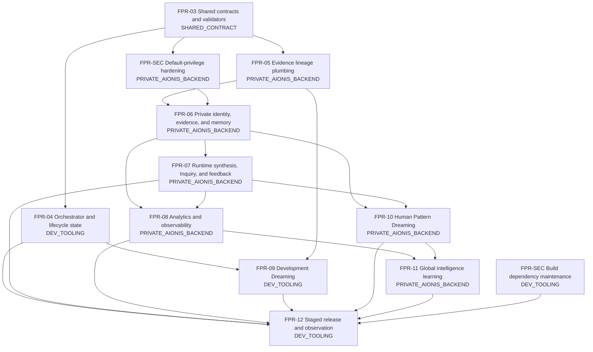

# Aionis Operating-System Dependency Map

Audit baseline: `9041d142f87ab48a8706a333cfebd70d702783fb`
Audit branch: `audit/aionis-operating-system-gap-analysis`

This map assigns exactly one target to every recommended future PR. It describes dependencies only; it does not authorize implementation.

Dependency references resolve against the 60 normalized entries in `requirement-matrix.json` schema version 2.0.0. Future-phase requirements may be `NOT_CURRENTLY_APPLICABLE` until authorized; hard prerequisites use `BLOCKED_BY_DEPENDENCY`.

## Future PR contracts

| ID | Target | Owns | Hard dependencies | Required proof | Human gates |
| --- | --- | --- | --- | --- | --- |
| `FPR-03-contracts-validators` | `SHARED_CONTRACT` | Reconcile draft schemas with numbered documents; add approval/memory contracts and an operating-system manifest instance; correct stale checkpoints and paths; add deterministic schema, skill, link, manifest, and scope validation to CI | This audit approved; decisions for lifecycle states, analytics linkage, Dream rollback, runtime budget fields, and actual PWA cache naming | Draft 2020-12 validation; valid/invalid golden instances; all references resolve; workflow and product regressions pass; audit findings mapped to changes | Plan, Code |
| `FPR-SEC-build-dependency` | `DEV_TOOLING` | Review and update the Vite/PostCSS development dependency chain; add an explicit dependency-audit policy/check | Compatible fixed resolution; trusted lockfile update | Full audit reviewed; production audit clean; lint, tests, build, and PWA output unchanged | Security, Code |
| `FPR-SEC-default-privileges` | `PRIVATE_AIONIS_BACKEND` | Deny-by-default privileges for future `public` tables, sequences, and functions for both `postgres` and `supabase_admin` creator paths | Supabase platform-owner authority; reviewed global/default-privilege design; safe dry run; no new public object beforehand | New-object privilege probes for both creator roles; existing `people` pgTAP; advisors; rollback rehearsal | Plan, Security, Code, Release |
| `FPR-04-orchestrator-lifecycle` | `DEV_TOOLING` | Feature state, assignments, ownership collision, handoffs, approval invalidation, and gate enforcement | `FPR-03` | State-transition, collision, integration-contract, handoff acceptance, missing-evidence, stale-approval, and privilege-boolean tests | Plan, Code |
| `FPR-05-evidence-lineage` | `PRIVATE_AIONIS_BACKEND` | Append-only evidence records, generation manifests, version registry, supersession, reproducibility records, and rollback history | `FPR-03`; private storage and access design | Digest/immutability, provenance, access scope, supersession, generation completeness, rerun, comparator, and rollback-history tests | Plan, Security, Intelligence, Code |
| `FPR-06-private-evidence-memory` | `PRIVATE_AIONIS_BACKEND` | Private identity/tenant boundary, personal evidence store, memory planes/forms, retention/deletion, consent, staleness, confidence decay, audit records | `FPR-05`; `FPR-SEC`; approved identity and consent model | User/org isolation, retention/deletion, consent, plane routing, staleness, decay, append-only and cross-user leakage tests | Plan, Security, Intelligence, Code |
| `FPR-07-runtime-intelligence-feedback` | `PRIVATE_AIONIS_BACKEND` | Runtime model routing, exact manifests, timeouts/retries/budgets, queue controls, synthesis, explanation, Inquiry, feedback-as-evidence | `FPR-06`; approved runtime provider and intelligence contract | Exact model/config identity, fallback gate, budget/concurrency/idempotency/dead-letter/cancel, citation, contradiction, Inquiry, and feedback lineage tests | Plan, Security, Intelligence, Code |
| `FPR-08-analytics-observability` | `PRIVATE_AIONIS_BACKEND` | Separate operational and product/intelligence contracts, event ingestion, retention/deletion, alerts, missingness and version comparisons | `FPR-06`; runtime/product event decisions; preferably `FPR-07` | Contract/event validation, prohibited-field rejection, consent/tenant isolation, sampling, aggregation, retention/deletion, alert and bias/missingness tests | Plan, Analytics, Security, Intelligence, Code |
| `FPR-09-development-dreaming` | `DEV_TOOLING` | Sanitized development events, immutable cursor, snapshot, idempotent detectors, proposals, negative knowledge, allowed maintenance | `FPR-04`; `FPR-05`; approved maintenance policy | Empty-run, cursor replay, idempotency, PII rejection, duplicate/contradiction/stale/TODO/failure detection, cost, rejection retention and forbidden-auto-apply tests | Dream, Code |
| `FPR-10-human-pattern-dreaming` | `PRIVATE_AIONIS_BACKEND` | Pattern Ledger service, Human Pattern proposals, sensitive approval, profile versions, explanation and rollback | `FPR-06`; `FPR-07` | Evidence class, support/contradiction, user/org isolation, conditional synthesis, Inquiry, sensitivity, confidence decay, approval and supersession tests | Dream, Intelligence, Security, Code |
| `FPR-11-global-learning` | `PRIVATE_AIONIS_BACKEND` | Eligibility contract, consent/de-identification, cohort thresholds, suppression, evaluation, methodology proposals and intelligence version release | `FPR-08`; `FPR-10`; approved aggregation methodology | Consent eligibility, small-cohort and linkability rejection, leakage/bias/calibration/subgroup evaluation, version comparison and rollback | Dream, Intelligence, Security, Release |
| `FPR-12-release-pipeline` | `DEV_TOOLING` | Branch protection, required checks, staging, release manifests, artifact digests, rollback rehearsal, production approval, observation, consolidation | `FPR-04`; all capability PRs included in the release | Protected-main proof, immutable manifest/digest, CI/database/browser/security checks, staging smoke, approvals, rollback rehearsal, observation and sanitized consolidation | Release plus all impact gates |

## Existing implementation dependencies to preserve

| Contract | Owner target | Evidence | Any future PR must prove |
| --- | --- | --- | --- |
| Approved formula engine | `PUBLIC_STUDENT_APP` | `lib/numerology.ts`; locked SHA in `tests/numerology.test.mjs` | No formula diff, or explicit formula approval and auditor evidence |
| Authentication and people ownership | `PUBLIC_STUDENT_APP` | `features/auth/`, `features/people/`, `supabase/migrations/`, pgTAP | Auth/session safety, minimal fields, per-user RLS, no cross-user access |
| Legacy local import | `PUBLIC_STUDENT_APP` | `features/people/legacyImport.ts`, `usePeople.ts` | Key unchanged, explicit consent, original local value retained |
| One-page shared Report | `PUBLIC_STUDENT_APP` | `app/page.tsx`, `app/globals.css`, formula fixtures | Screen/comparison/print parity and a real one-page A4 proof for print changes |
| Build-time workflow isolation | `DEV_TOOLING` | `.agents/skills/`, `docs/ai-context/`, `.vercelignore` | No development controls, telemetry, tokens, or owner functions in the student bundle |

## Stop conditions

- Do not add another `public` database object before `FPR-SEC-default-privileges` is resolved or a Security Gate explicitly accepts a bounded exception.
- Do not build orchestrator state or backend persistence against the unreconciled draft schemas.
- Do not introduce runtime AI before private identity, evidence lineage, isolation, consent, and generation contracts are approved.
- Do not begin global learning before Human Pattern isolation and analytics eligibility are proven.
- Do not treat successful CI or a Vercel Preview as production approval.
